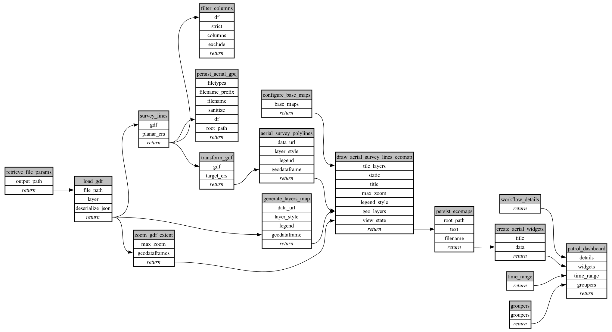

```
# AUTOGENERATED BY ECOSCOPE-WORKFLOWS; see fingerprint in README.md for details

```

```yaml
# fingerprint:
artifacts_sha256_basic: 754e553e7d432c418d61ed979aa638bc149615f57593a192d48684c7f5ff5b5c
artifacts_sha256_strict: 6d550ad0cbdcb6def3af0bac9e3147541c941345d2bb91923c1a70da65fa74fb
installed_requirements:
- channel: https://repo.prefix.dev/ecoscope-workflows/
  name: ecoscope-platform
  version: {version: ==2.15.1}
- channel: https://repo.prefix.dev/ecoscope-workflows-custom/
  name: ecoscope-workflows-ext-custom
  version: {version: ==0.1.0rc14}
- channel: https://repo.prefix.dev/ecoscope-workflows-custom/
  name: ecoscope-workflows-ext-ste
  version: {version: ==0.0.0rc1}
- channel: conda-forge
  name: pydeck
  version: {version: ==0.9.2}
params_sha256: e7b8ef880bd6c73a47cbc923e0054017a12fea32fb9ebd0b9b96a75586ad4bf1
spec_sha256: 558c3425393a19c92efcbbc80e41a5c6594290392bc75923887fc3693bf44b83

```

# ecoscope-workflows-aerial-survey-roi-workflow


