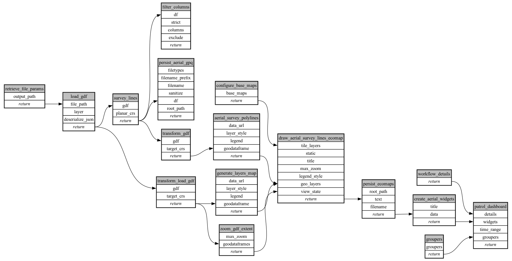

```
# AUTOGENERATED BY ECOSCOPE-WORKFLOWS; see fingerprint in README.md for details

```

```yaml
# fingerprint:
artifacts_sha256_basic: 2fd127e8154e3f448d558efcd029cde827d9bb41847a669de53bf8171c6f7d4d
artifacts_sha256_strict: 3dacea602ea40d815757137f924a32f9c99a36d44af6fd1bdd76b2568c0a80ee
installed_requirements:
- channel: https://repo.prefix.dev/ecoscope-workflows/
  name: ecoscope-platform
  version: {version: ==2.25.0}
- channel: https://repo.prefix.dev/ecoscope-workflows-custom/
  name: ecoscope-workflows-ext-custom
  version: {version: ==0.1.0rc14}
- channel: https://repo.prefix.dev/ecoscope-workflows-custom/
  name: ecoscope-workflows-ext-ste
  version: {version: ==0.0.0rc1}
- channel: conda-forge
  name: pydeck
  version: {version: ==0.9.2}
params_sha256: 6c7df0268dcd2aaadd0db5bdb6850e1c3841183489c88025d4dff977dd7dd861
spec_sha256: f3432dae414db69a9c46a4f71d7fb70f6c497151d94fc9db800005b896433607

```

# ecoscope-workflows-aerial-survey-roi-workflow


